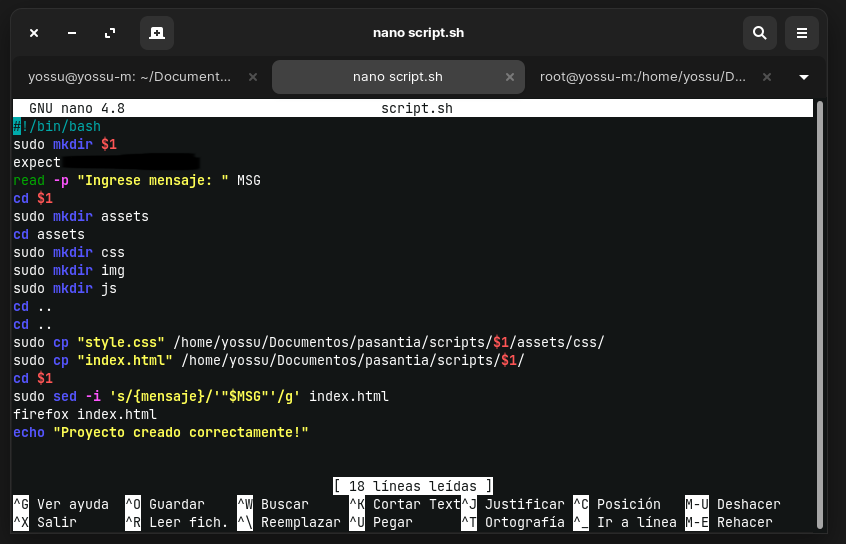
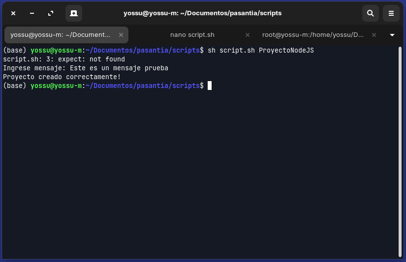
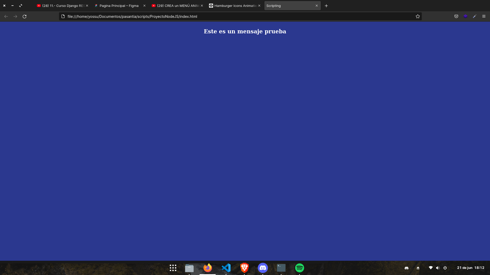

# Deploy de aplicacion Vite + RECT con Vercel

## Overview vercel 

# Activida de creacion Script con Bash 
En la carpeta de Scripts se encuentra el Scritp y los archivos que use. A continuación el script:

### Script ejecutado 

### Mensaje en el navegador web

