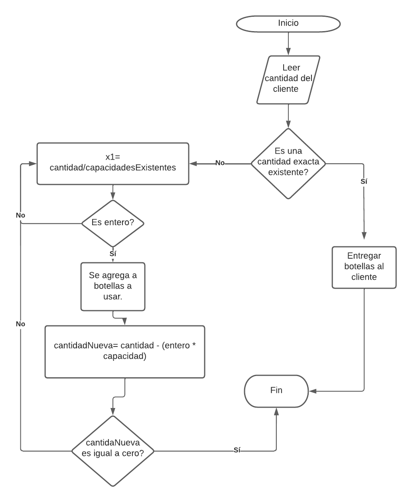
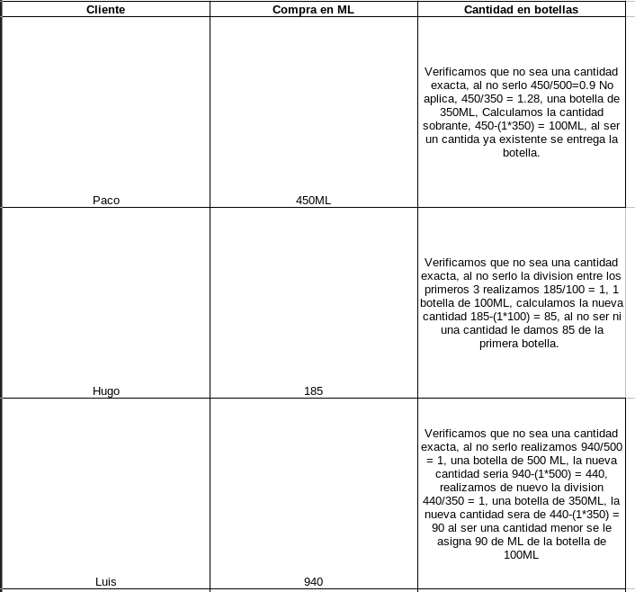
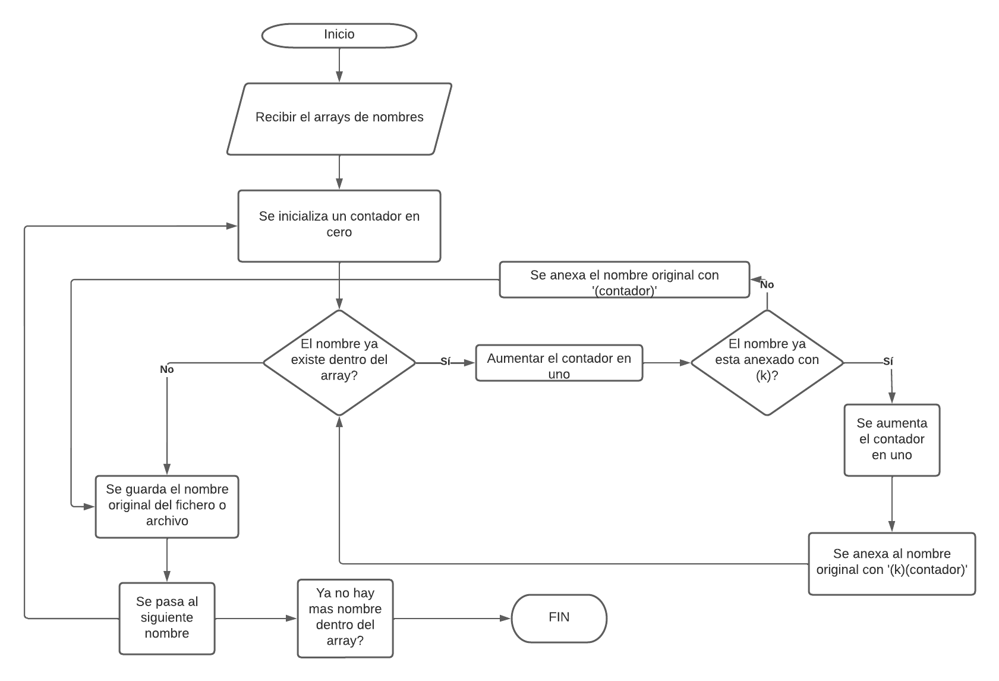

# Actividad de problemas de Lógica General
### 1. Problema tienda de productos de limpieza
### **Solucion**

1. ¿Qué haría usted para que cuando un cliente compre algún producto se utilicen la menor cantidad de botellas, y se desperdicie la menor cantidad de espacio en las mismas?

- Primero verificaria si el cliente desea una cantida exacta de algun producto existente para no vaciar o llenar una botella mas, lo que evitaria tener perdidas.

- Como segundo paso se divide entre la cantida que requiere el cliente con las capacidades que existentes, si el resultado entero es 0, significaria que no necesita botellas de esa capacidad, ahora bien si el numero resultante de la division es un entero positivo signfica que esa capacidad necesita esa cantida de botellas. Seguidamente realizamos una multiplicacion la cantidad de botellas por la capacidad y se la restamos a la cantidad original para determinar cuando hace falta para realizar otra vez la division.

- El tercer paso es descontar las botellas que se han utilizado para ya no tenerlas en cuenta para el inventario. 

2. Plasme la descripción de su algoritmo.

Se utilzo un diagrama para una mejor compresion. 

3. Ejemplifique cómo distribuiría el liquido en los contenedores de la tabla de arriba con las siguientes compras ficticias, siguiendo su propuesta.

### 2. Problema Taller de Santa Claus
### **Solucion**

1. Se le pide realizar el algoritmo para la implementacion la funcion descrita anteriormente.

Se realizo un diagrama para mayor compresion.

