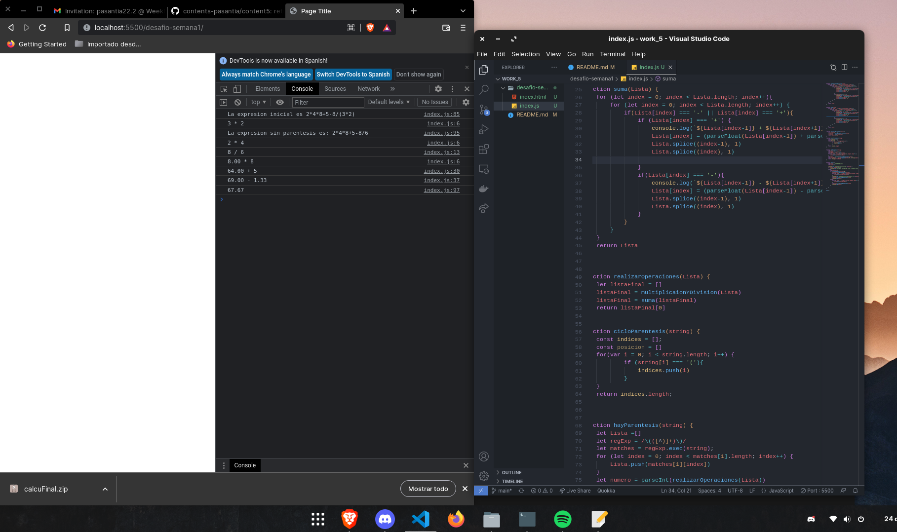
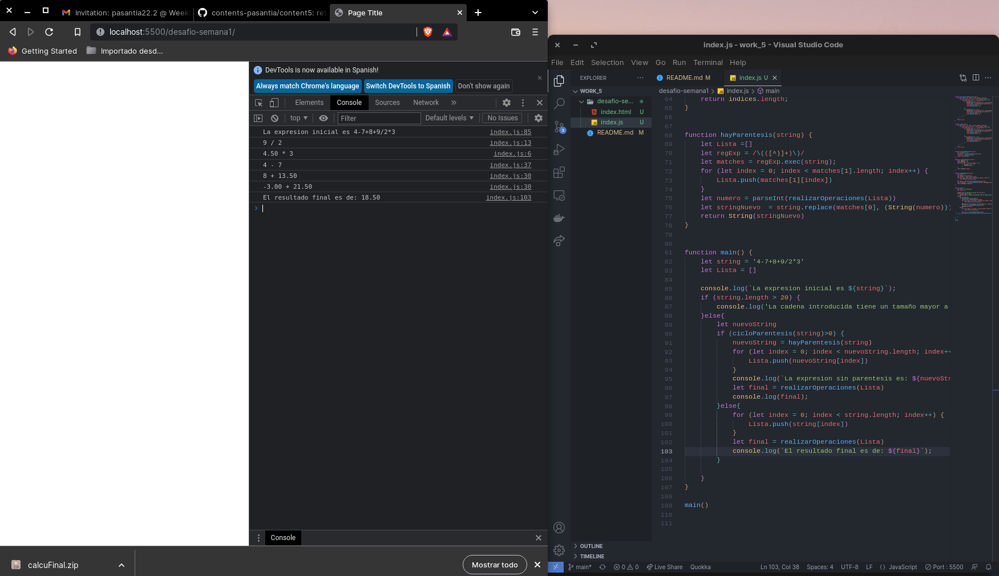

## Reto de la Semana 

### Solucion:

La solucion del reto semanal lo realiza el siguiente algoritmo:

1. Verificamos que el String ingresado sea menor a los 20 caracteres permitidos. 

2. Luego de pasar la primera verificacion pasa a una segunda verificacion, la cual consiste en que no exista algun parentesis, si existe algun parentesis se cumplira una condicion que activara una fucion para que se ejecute primero la parte de los parentesis. 

 - La funcion de los parentesis funciona de la siguiente manera, primero con una expresion regular (**/\(([^)]+)\)/**) obtenemos la parte interior de los parentesis, obtenida esta parte le mandamos la funcion principal que es la que realiza las operaciones esta devolvera un numero el cual se remplazara dentro del string original, de esta manera ya pasamos el string sin ningun parentesis y con la jerarquia de parentesis ya aplicada.

3. Ahora que tenemos la cadena sin ningun parentesis pasamos el string a la funcion Realizar operaciones, dentro de ella existen otras dos funciones, una de *multiplicaciones y divisiones* y otra de *suma y restas* 

 -Ambas funciones trabajan de la siguiente manera: Primero recorre toda la cadena en orden de izquierda a derecha en busca de caracteres '*', '/', '+' y '-' que son lo que indican que hay multiplicaciones y divisiones, si encuentra uno entonces agarra el caracter anterior y el caracter siguiente y realiza la operacion, luego de haberla realizado remplaza el caracter del operador por el resultado y elimina el caracter anterior y el siguiente seguidamente vuelve a recorre la cadena en mas busca de de caracteres de operaciones algebraicas si no encuentra regresa la lista ya con unico valor dentro de ella. 

 Diagrama para mejor entendimiento

 ## Pruebas en ejecucion 

